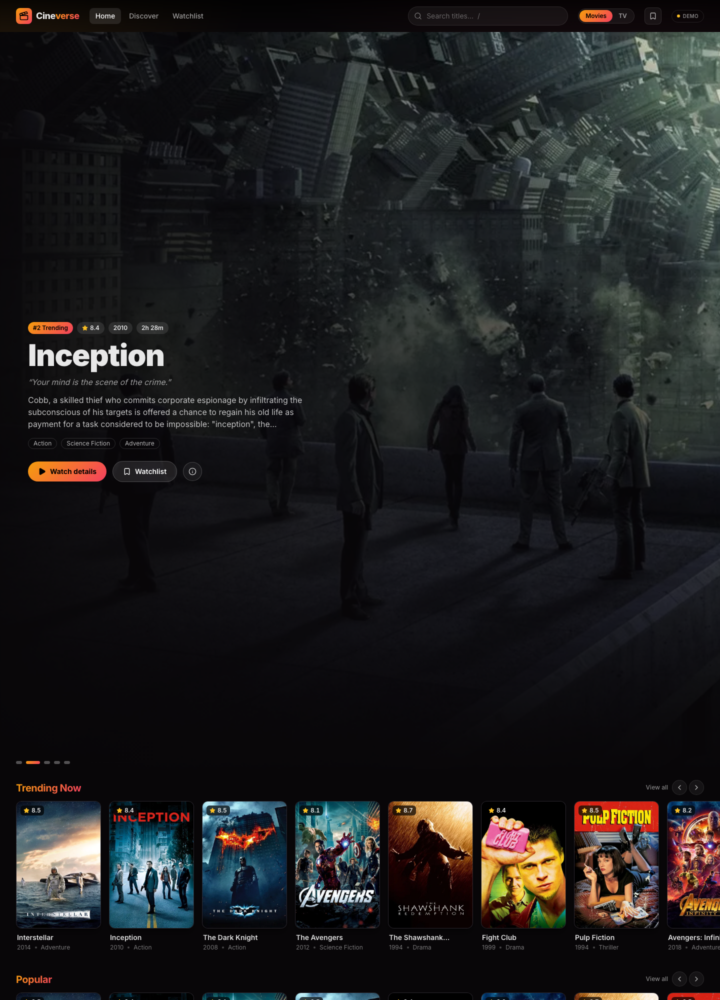
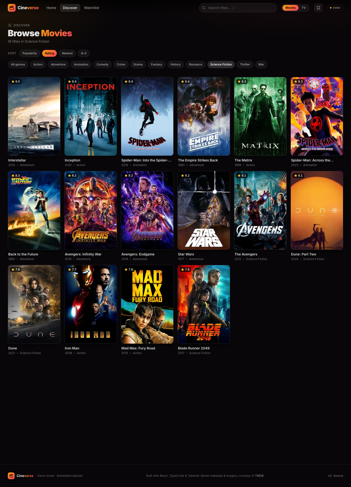
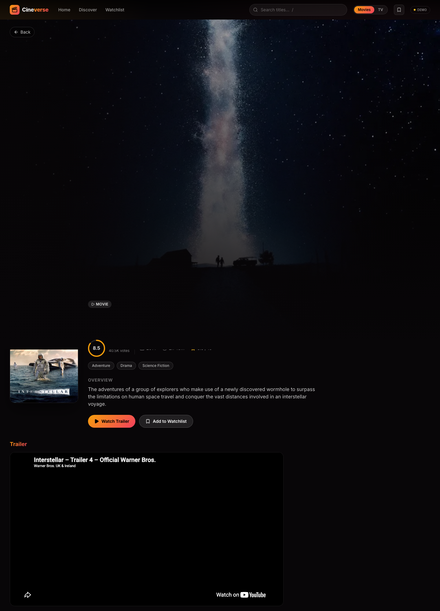
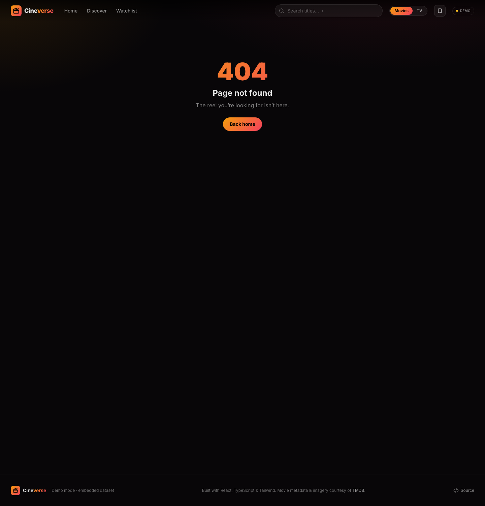

# 🎬 Cineverse

A modern movie & TV discovery app — browse trending titles, explore by genre,
search, and build a watchlist. Built with React, TypeScript, and Tailwind CSS.

It runs with **zero setup**: a rich embedded dataset (with real poster art)
powers the whole app out of the box, and it optionally switches to the live
[TMDB](https://www.themoviedb.org/) API when a key is provided.

## Screenshots

| Home | Discover |
| --- | --- |
|  |  |

| Movie detail | Watchlist |
| --- | --- |
|  |  |

## Features

- **Home** — trending hero carousel plus horizontal rails (Trending, Popular,
  Top Rated, Now Playing, and genre rows)
- **Discover** — filter by genre, sort by popularity / rating / year
- **Search** — live search across the catalog
- **Detail pages** — backdrop hero, overview, rating, runtime, genres, cast, and
  a "More like this" rail
- **Watchlist** — add/remove titles, persisted in `localStorage`
- **Movies ↔ TV** toggle
- Responsive, dark, cinematic UI with skeleton loaders and smooth transitions

## Tech stack

- React 18 + TypeScript
- Vite
- Tailwind CSS
- React Router
- lucide-react (icons)

## Getting started

```bash
npm install
npm run dev      # start the dev server
npm run build    # production build
```

### Demo mode vs. live TMDB

By default the app uses an embedded mock dataset, so it works with no
configuration. To use live data from TMDB instead, copy `.env.example` to
`.env` and set your key:

```bash
VITE_TMDB_API_KEY=your_tmdb_key_here
```

## License

MIT
